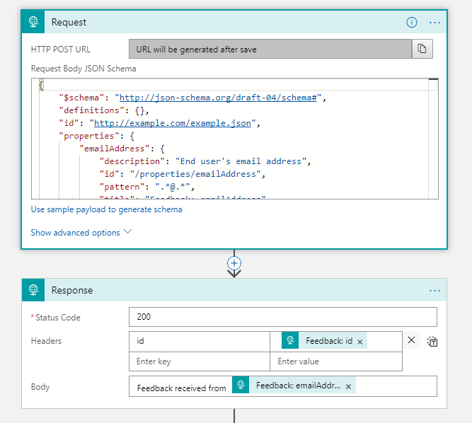
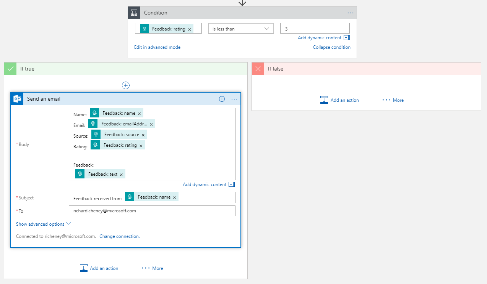
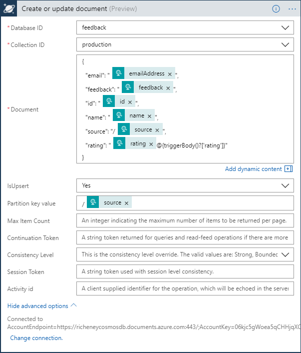

Logic App lab for the Azure 101 workshop.



## Introduction

Logic Apps are quick plug and play "if .. then ..." constructs to help developers and power users to quickly integrate systems.  They complement some of the other PaaS type offerings such as serverless Functions, or Event Grid and other event based services.

In this logic app lab we will create a quick HTTP endpoint for feedback, that could then be used by websites, mobile apps or custom applications.  The feedback could be added into a Service Bus, or added to a persistent database.  

In our logic app we will be sending an email out containing the feedback information in this lab if the feedback rating is poor.

## Tutorial

### Deploy Cosmos DB

The Cosmos DB will take a little while to fully deploy, so we'll deploy that first. 

* Click **Add** in the Azure101PaaS resource group
* Add Azure Cosmos DB
  * ID: **\<yourname>cosmosdb**
  * API: **SQL (DocumentDB)**
  * Resource Group: **Azure101PaaS**
  * Location: **West Europe**

Now open up another tab and continue with the following steps.   

### JSON Payload

* Open the [example JSON payload](./feedback.json) into a new tab.  This is the format that the various applications will use for feedback into our system.  
  * The ID is the number of UTC milliseconds
  * The rating is an integer score of 1 to 5 inclusive, i.e. based on the number of stars the fictitious user has rated it on
* Open the [JSON schema](./schema.json) into a new tab.  The schema describes the expected format.  This has been created using the example payload via the excellent https://jsonschema.net website. 
* Select the schema contents and copy them to the clipboard as we will use this later when defining the Logic App.

### Create the Logic App

* Click on **+New** or **Add** 
* Find _Logic App_ and click on **Create**
  * Name: **feedbackWorkflow**
  * Resource Group: **Azure101PaaS**
  * Location: **West Europe**
* Click into the new Logic App once deployed
* Select **Blank Logic App** in the Logic Apps Designer screen

### Define the Logic

We'll define a REST API point, and the expected schema for the JSON.  Once the request has been received then we'll send back a response.

If the rating is below 3, then we'll send ourselves an email.

#### Request

* Search for **Request** / Response for the trigger
  * Paste in the JSON schema

#### Response

* Click on **+New Step** and then **Add an action**
* Search for Request / **Response** for the action
  * Use the default HTTP status code of 200
  * Add a header, with **_id_** as the key and **_Feedback: id_** as the value
    * Click on the _Add dynamic content_ button and select **Feedback: id**
  * Body: **Feedback received from _Feedback: emailAddress_**



#### Send an email

* Click on **+New Step** and then **Add a condition**
  * Value:  **_Feedback: rating_**
  * Operator: **is less than**
  * Value: **3**
* In the "If true" branch, add an action
* search for "_email_" and choose a platform.  The steps below are for Office 365 Outlook.
  * Click on the **Send an Email** action
  * Sign in to create the connection
  * To: **yourEmailAddress**
  * Subject: **Feedback from _Feedback: name_**
  * Body: Add in all of the useful information from the JSON payload
* Click on **Save**



### Test the Logic App

* Click on the breadcrumb for the Logic App itself rather than the Designer to show the Trigger History in the Overview
* Click on the copy icon on the right of the **Callback url [POST]**.  This is the HTTP REST API endpoint.
* Open up the Postman app, skipping login
  * Change the action to **POST**
  * Paste the HTTP REST API into the _Enter request URL_ field
  * Leave Authorization as _No Auth_
  * Add one header:
    * Key: **Content-Type**
    * Value: **application/json**
  * Toggle the Body type to raw
  * Open the [example JSON payload](./feedback.json) we saw earlier into a new tab, and copy the contents to the clipboard 
  * Paste the JSON payload into Postman
  * Click on the blue **Send** button
  * The HTTP response from the Logic App should show in the bottom pane:

  

### Finishing up

* Go to the Overview area of the Logic App
* Check that there is a new entry in the Trigger History
* Click on the new **Runs History** entry to view the details
  * Open up the individual steps to view the inputs and outputs
* Check your inbox and verify that the feedback email has been received
* Go into the **Azure101PaaS** resource group and review the new resources that have been created 

### Adding a permanent record into Cosmos DB

* Go into the Cosmos DB resource
* Add a **Collection**
  * Collection Id: **production**
  * Storage Capacity: **Fixed (10GB)**
  * Initial Throughput Capacity (RU/s): **400**
  * Partition Key: **/source**
  * Database: **feedback**

  

* In the Cosmos DB Overview area, copy the URI
  * URI form **https://_\<ID>_.documents.azure.com:443/**
*Open up a new tab and go back into your Logic App
* Click on **Edit** to open the Logic App Designer
* Add a new action between Response and the Condition
  * Hover the mouse over the arrow under Response and a **+** sign will appear
* Search on Cosmos DB and select _Create or update document_
* Create the connection manually
  * Click on the _Manually enter connection information_ link
  * The required values for Connection Name and  Access Key can be found in the Cosmos DB **Keys** area 
    * **Connection Name** = Primary Connection String
    * **Account ID** = first part of URI, i.e. https://**\<Account ID>**.documents.azure.com:443/ 
    * **Access Key** = Primary Key
  * _Tip_: Open up a new tab or window to portal.azure.com and copy the values using the icon on the right of each field  
* Set the parameters for the _Create or update document_ action
  * **Database ID**: Select _TablesDB_ from the drop down
  * **Collection ID**: Select _feedback_ from the drop down
  * **Document**: Enter the following, replace ``_variableName`` with the dynamic content:
  ```
  {
    "email": "_Feedback: emailAddress_",
    "feedback": "_Feedback: feedback_",
    "id": "_Feedback: id_",
    "name": "_Feedback: name_",
    "source": "/_Feedback: source_",
    "rating": "_Feedback: rating_"
  }
  ```
  
  * Set **IsUpsert** to _Yes_
    * This allows both updates and inserts
  * In advanced option, set the **Partition key value** to /_Feedback: source_
  * _Note the leading slash in the partition value, and that this exactly matches the source variable in the JSON - this is key to make the partitioning work_
* Save
* Below is an example of the _Create or update document_ logic

  

* Retest a feedback submission by going into Postman, changing the body of the JSON (choose a new name, email address and feedback message) and then clicking **Send**
* Check the Run History and view the outputs
* Go into Cosmos DB and use the Data Explorer to verify that the feedback is beeing collected successfully
* Note that the logic app also allows drag and drop reordering of steps
  * Prove this by moving the Cosmos DB document step above the HTTP Response
* It is also possible to cosmetically rename the steps


-------------------------------------------------------
## Quick Navigate:
* Back up to [**Azure 101**](./azure101Index.md/#introduction) main page
  * [Lab: **Using the portal and creating a vNet**](./azure101PortalLab.md/#introduction)
  * [Lab: **Windows and Linux VMs**](./azure101VMLab.md/#introduction)
  * [Lab: **Deploying to Web Apps from GitHub**](./azure101WebAppLab.md/#introduction)
  * [Lab: **Using Logic Apps**](./azure101LogicAppLab.md/#introduction)