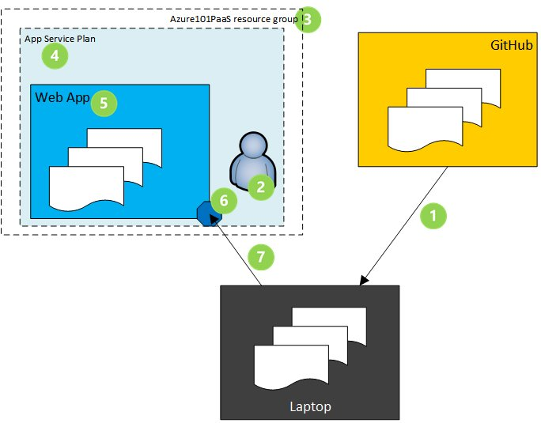

Web App lab for the Azure 101 workshop.



# Azure 101 Web App Lab

## Introduction

The PaaS section of the lab will touch on both Web Apps and Logic Apps. The Web App lab is split into two options - the first option is for students who are familiar with Git and uses this method to push files to the Web App, while the second option is aimed at students who are less familiar with Git tools and therefore uses the portal to pull files into the Web App.

--------------------------------------------

## Option 1: Using Git to push files to Web App

The diagram below gives an overview of what we are doing with a set of html
files hosted on GitHub and pushing those into a Web App in Azure using Git.



1.	Use git clone to download the sample static HTML site from GitHub to your laptop
2.	Login to Azure and create a deployment user
3.	Create the Azure101PaaS resource group
4.	Create the free tier app service plan
5.	Create a web app within the app service plan
6.	Configure a Git access point for the web app
7.	Define the access point as an upstream git repo called “azure”, and use git push to add the html files

### Select your console

If the [Bash and CLI 2.0 prereqs](../prereqs/prereqLxss.md) have been followed then those Windows 10 should users will have installed the Linux subsystem, and then installed both CLI 2.0 and Git into that subsystem.  If so then open a Command Prompt and then type ``bash``.  Type in ``az login`` and follow the instructions. This will be your console.

Everyone else may use the Cloud Shell (**>_**) shown at the top of the Azure Portal.  This will create some local storage the first time you use it.  There is no need to login to Azure as it is done automatically for you.  (Note that we will not be using the permanent storage folder clouddrive as it does not support the file permissions required by git commands, so the clone of the Github repo will be transient.)  This will be your console.

### Instructions

**1. Clone the HTML files from Github**

* •	Type (or copy and paste) the following commands into the console, changing the value for appName to include your name or alias.  Note that the appName value will need to be globally unique as it will form the web URL.
```
git clone https://github.com/richeney/azure101-webapp-html
cd azure101-webapp-html
git init
ls -Al
pwd

git config --global credential.helper cache
rg=Azure101PaaS
user=azure101deploy
pwd=azure101p455w0rd
appName=azure101YourNameHere
```
* The above commands copy the HTML files locally, change to that directory, initialise it for Git, and then finally lists the files.  The pwd command prints the working directory so that you know where they are.
* We are then setting git to cache our credentials after the first successful connection to a remote, and also defining some variables to use in the commands in the following sections.
* Double click the _index.html_ file in File Explorer to view the website locally.  You should see a couple of pieces of static images and text on the left, and a Twitter timeline on the right.  If you are in the Cloud Shell then cat index.html will display the raw html.  

**2. Log in to Azure using the CLI 2.0 and create the deployment user:**

* Create the deployment user:
```
az webapp deployment user set --user-name $user --password $pwd
```
* You will be prompted to make your username or password more unique if you have chosen one that is too common, although the error is a basic 400 decline HTTP error
* The deployment user is the equivalent of a service account so that Git can authenticate to Azure and deploy to it

**3. Create the resource group:**

* Create the resource group
```
az group create --name $rg --location westeurope
```

**4. Create the App Service plan:**

The App Service plans provide the underlying resources for your apps, and multiple apps can use them. The plans define the region, available instance sizes, scale count and SKU level, i.e. free, shared, basic, standard, premium.

* Create an App Service plan called quickStartPlan on the Free SKU
```
az appservice plan create --name quickStartPlan --resource-group $rg --sku FREE
```
* You should see output JSON when the above command succeeds

**5. Create the Web App:**

* Create the Web App. The name for the Web App must be globally unique as it forms part of the FQDN. You will be prompted to change it if it already exists.

```
az webapp create --name $appName --resource-group $rg --plan quickStartPlan
```
* Again, there will be output JSON when the command succeeds
* Open your web browser and navigate to http://<unique_app_name>.azurewebsites.net. (You will also find the link in the new web app in the Azure portal.)
* You should see a ‘placeholder’ web page – this indicates that the web app is running and ready to be configured.


**6. Create the Git deployment access point:**

* Create the http endpoint for the deployment:
```
deployuri=$(az webapp deployment source config-local-git --name $appName --resource-group $rg --query url --output tsv)
echo $deployuri
```
* The first command create an https endpoint similar to below, and then saves that value into the $deployuri variable.  The second prints the variable to screen, e.g.:
```
https://<username>@<appname>.scm.azurewebsites.net/<appname>.git
```
* Note the _scm_ section of the URL - this is the Kudu address. We’ll come back to that later

**7. Add a Git remote called _Azure_ and then push to the Web App:**

* Create the Git remote, calling it azure:
```
git remote add azure $deployuri
git remote -v
```
* Push the master branch of the local html repo up to the azure remote
```
git push azure master
```
* Refresh the web page and confirm that it has changed

**8. Change the HTML and push again to the Web App:**

* Edit the index.html to change the Twitter account to your own.  Uou can use ``nano index.html``, or ``vi index.html`` for those familiar with using terminal editors. Or you may go into the web app in the portal and use the App Service Editor in the blade and edit the index.html directly in the browser. 
* Push the changes up to the azure remote
```
git push azure master
```
* Refresh the web page and see if it has been changed

### If you have time:

There is a rich ecosystem built around the PaaS applications.  If you have time then explore the ecosystem for Web Apps

* Browse the blade in the portal, checking out deployment slots, scale up and out, App Service Editor and Application Insights
* Click on your website link. Access Kudu by inserting scm before azurewebsites.net, i.e. https://\<website>.scm.azurewebsites.net/.

--------------------------------------------------------

## Option 2: Using FTP to push files to Web App

The diagram below gives an overview of what we are doing with a set of HTML
files hosted on GitHub and pushing those into a Web App in Azure using FTP.


1.	Use git clone to download the sample static HTML site from GitHub to your laptop.
2.	Login to Azure and create a deployment user.
3.	Create the Azure101PaaS resource group.
4.	Create the free tier app service plan.
5.	Create a web app within the app service plan.
6.	Upload HTML files to the web app using FTP.

### Detailed Instructions

For the Git commands, most users will use the Git Bash application.  However, those with the Linux subsystem installed on Windows 10 can run the git commands from there. For the Azure CLI 2.0 commands, students can use either the Azure Cloud Shell (>_) shown at the top of the Azure Portal, or the Linux subsystem for Windows 10 with the AZ CLI 2.0 installed.

**1. Clone the html files from GitHub to your local machine:**

* Open Git Bash and run the following:

```
git clone https://github.com/richeney/azure101-webapp-html
cd azure101-webapp-html
git init
ls -Al
pwd
```

* The above commands copy the HTML files locally, change to that directory, initialise it for Git, and then finally lists the files.  The pwd command prints the working directory so that you know where they are.

* Double click the _index.html_ file in File Explorer to view the website locally.  You should see a couple of pieces of static images and text on the left, and a Twitter timeline on the right.

**2. Log in to Azure using the CLI 2.0 and create the deployment user:**

```
az login
az webapp deployment user set --user-name <id> --password <pwd>
```

* You will be prompted to make your username or password more unique if you have chosen one that is too common.

**3. Create the resource group:**

* Within CLI 2.0 create the resource group

```
az group create --name Azure101PaaS --location westeurope
```

**4. Create the app service plan:**

App Service plans provide the dedicated resource for your apps, and multiple apps can use them. The plans define the region, available instance sizes, scale count and SKU level, i.e. free, shared, basic, standard, premium.

* Create an App Service plan called quickStartPlan on the Free SKU

```
az appservice plan create --name quickStartPlan --resource-group Azure101PaaS --sku FREE
```
You should see output JSON when the above command succeeds

**5. Create the Web App:**

* The name for the web app must be globally unique as it forms part of the FQDN. You will be prompted to change it if it already exists.

```
az webapp create --name <unique_app_name> --resource-group Azure101PaaS --plan quickStartPlan
```

* Open your web browser and navigate to http://<unique_app_name>.azurewebsites.net. You should see a ‘placeholder’ web page – this indicates that the web app is running and ready to be configured.


**6. 6.	Upload HTML files to the web app using FTP:**

In order to upload files to the web app, you will need an FTP client installed locally on your machine. Filezilla (https://filezilla-project.org/) is a good choice for this.

* In the _Overview_ section of your web app, make a note of the following fields:
    _FTP / Deployment Username_
    _FTP Hostname_

* Using your FTP client, create an FTP connection to your web app using the fields above and the password you selected earlier when creating the deployment user.

* At this point, you will see a directory listing on the remote host as follows:

![](https://ukpducim.github.io/images/Az101-DirectoryListing.jpg

* Drill down into the Site directory and then wwwroot.

* Copy the HTML files you cloned earlier into this directory on the remote host.

* Refresh the web page – you should see the example site containing the Twitter feed.

**7.Change the html and push it up again:**

* Edit the index.html locally to change the Twitter account to your own.

* Re-copy the index.html file to the web app using FTP.

* Refresh the web page and see if it has been changed.

### Web App Ecosystem

* Browse the blade in the portal, checking out deployment slots, scale up and out, App Service Editor and Application Insights

* Click on your website link. Access Kudu by inserting scm before azurewebsites.net, i.e. https://<website>.scm.azurewebsites.net/.