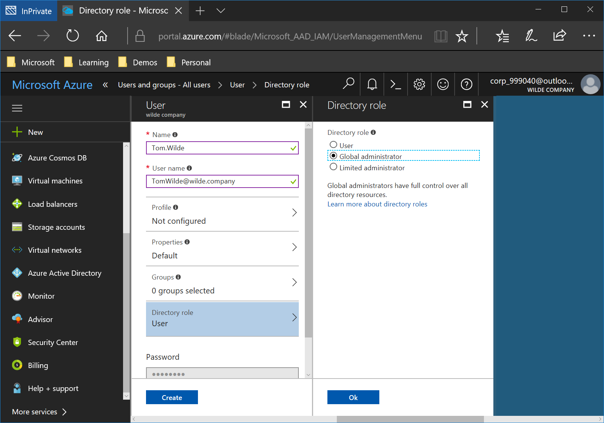
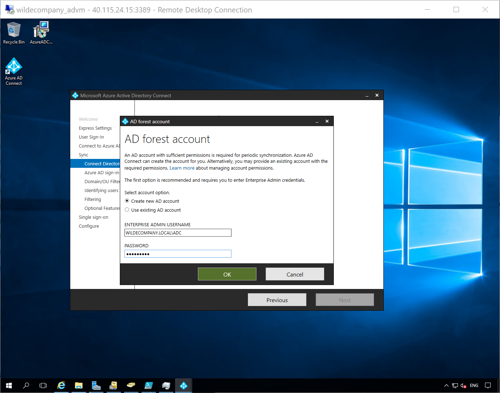
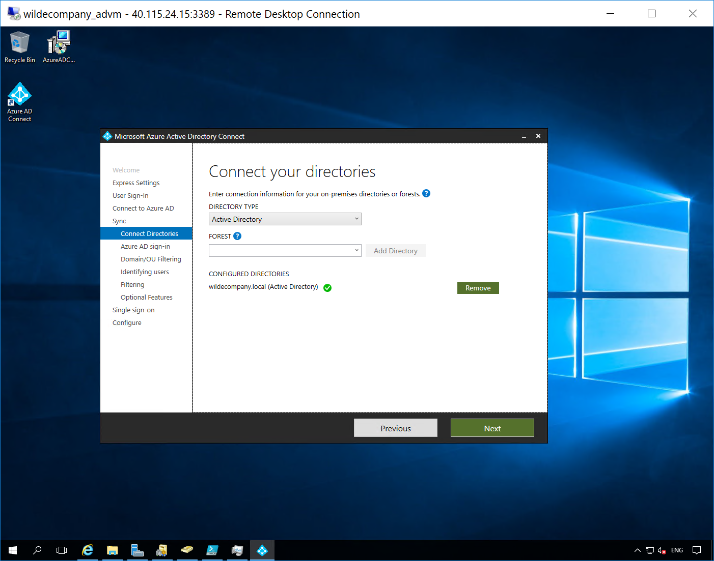
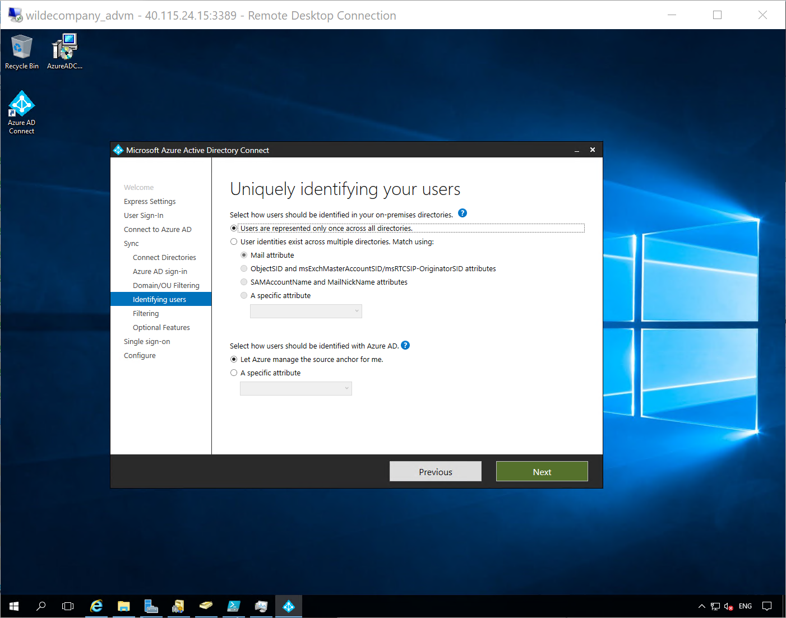
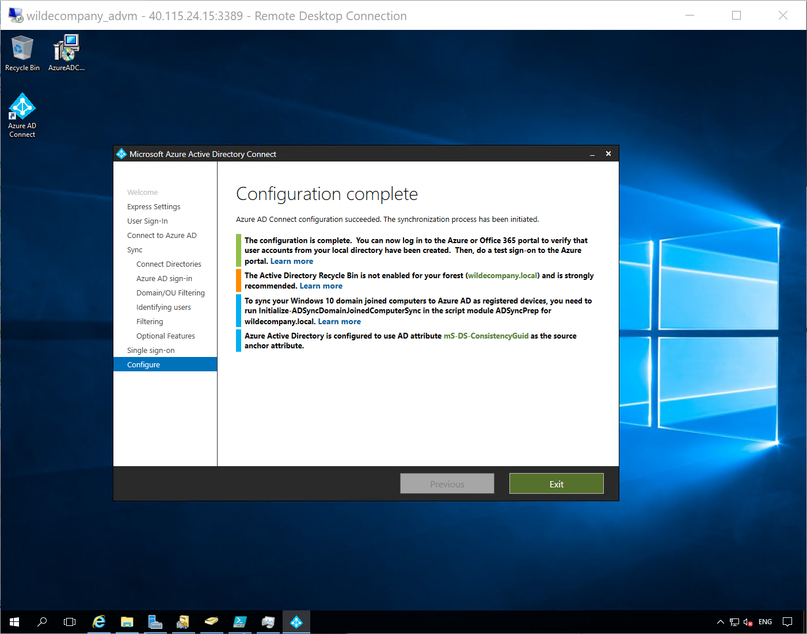

Extending Identities to the Cloud.



## Configure Active Directory Connect

We're almost ready to synchronize our identities, but first we'll create a new global admin (specifically for the new Azure AD Tenant) and use that account for AD Connect.

I will be creating a new Global Admin on my **wilde.company** Azure Active Directory Tenant and using that account in AD Connect to synchronize my on premise users (**userX@wilde.company**).

1. In Azure Portal > **Azure Active Directory > All Users > New User >** Set Name, User name and Global Administrator as the Directory Role
	
*Noticed I have created a global administrator **tom.wilde@wilde.company***

2. Log out of the azure portal and log in as the global administrator you just created.

3. In the Active Directory virtual machine (adVM), download Azure Ad Connect from https://www.microsoft.com/en-us/download/details.aspx?id=47594 and run the installer (you may need to change your internet zone settings to download the file). **Agree > Continue > Customize > Pass-through authentication** (this means all authentications are completed using the on premise Active Directory) **> Enable single sign-on** (this means users that use devices that are Active Directory domain joined will be automatically logged into cloud applications seamlessly - a great feature!)

4. Enter the Global Administrator details for the new Azure Active Directory Tenant **> Next**

*I have used my **tom.wilde@wilde.company** global admin*

5. Connect the Directories. **Add Directory > Create a new AD Account for AD Connect to use > OK**

6. On prem and cloud directories are now connected! **Next**
	

7. Notice the on premise domain shows not added and the new Azure Active Directory public domain shows as verified.
**Next**

8. Choose what OU's you want to sync. 

*All my users are in the Users organizational unit but you may seperate them out to remote/cloud/departmental groups.*

9. Choose how you want to uniquely identify your users **> Next**
	
*I only have a single on premise directory so the default options work but if you have multiple directory you need to choose what makes a user unique.*

10. **Next**

*Again, for this lab we can synchronize all users but you could apply some filtering to only sync the users that would use the cloud.*

11. **Password writeback > Next**

*I have selected password writeback (so any password changes in the cloud will replicate to on premise) and have not selected password synchronization (so passwords are not actually stored in the cloud).*

12. **Enable Single Sign on >** authenticate with your local domain admin **> Next**

*If you add Windows 10 devices to the on premise domain they can be authenticated automatically with cloud applications.*

13. Confirm you want to start synchronization after the installation is complete **> Install**

14. Notice the information displayed **> Exit**

15. Let's verify the connection, in the Azure portal **> Azure Active Directory > AD Connect**

*Notice my sync status, seamless single sign-on and pass-through authentication are all enabled for wilde company.*

16. **Users and Groups > All Users**

*Notice the new users and their usernames **x@wilde.company**, these have been synchronized from on premise.*

Lab complete. Now we have connected our on premise and cloud directories you can open up cloud functionality to those synchronized users! 

