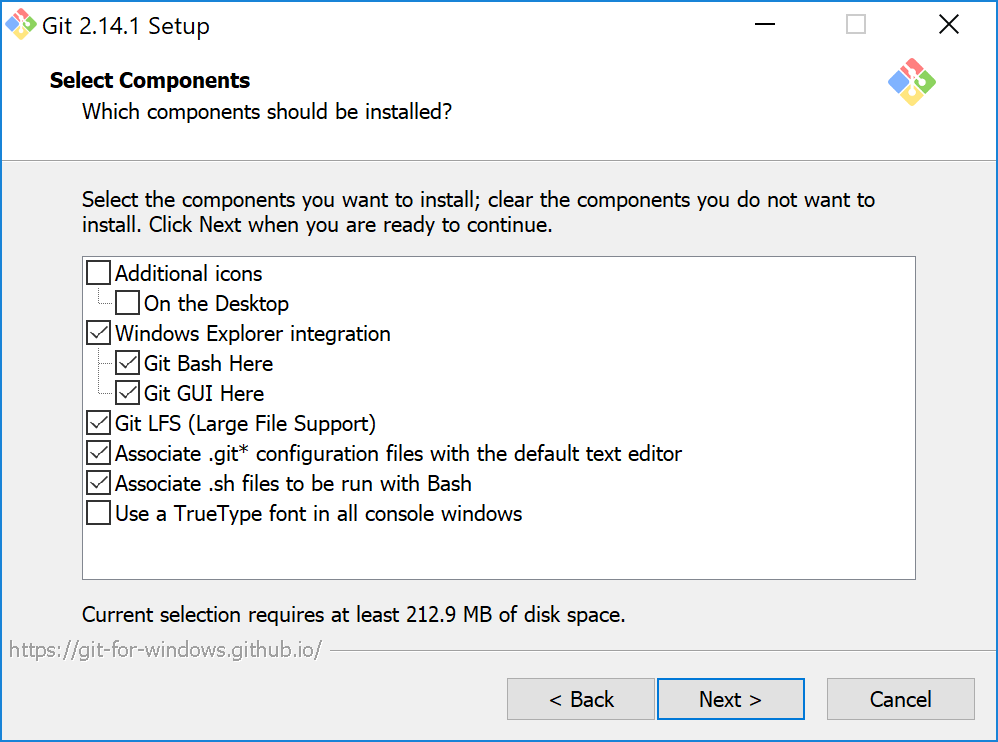

The following instructions are for installing Git for Windows or Git for Mac client software.  

If you are installing Git into a Linux distro (including the Windows subsystem for Linux) then use the standard module install commands for the distribution.  For example, the commands for Ubuntu would be `sudo apt-get update && sudo apt-get install git`. 

## Download & Install the Git software

* Download & Install [Git for Windows](https://git-scm.com/download/win) or [Git for Mac](https://git-scm.com/download/mac)
    * In the installation wizard take the default options but ensure that the following selections are made:

        1. Select **Ensure the following options are selected**

        

        2. Ensure **Use Git for the Windows command Prompt** is selected

        

        3. Ensure **Enable Git Credential Manager** is selected

        

## Verify the Installation

* Verify that Git is correctly installed by opening a **CMD** or **PowerShell** window & entering the command `git --version`

  If you don't see any errors Git is correctly installed.

## Configure Git

* Open a **CMD** or **PowerShell** new window and run the following commands (substituting your details as required):

```bash
git config --global user.email "youralias@microsoft.com"
git config --global user.name "Your Name"
git config --global credential.helper manager
```

